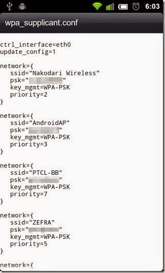
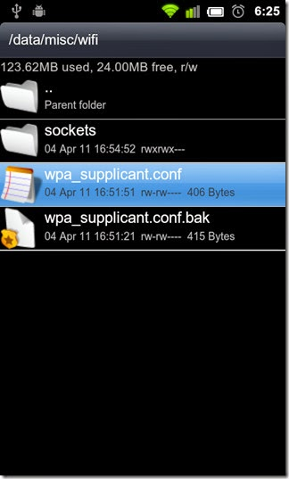

__Простой__ способ узнать пароли к wi-fi точкам, к которым подключен ваш девайс (вдруг забыли или кто-то ввел, чтобы вы не видели, а узнать охота):
посмотреть его в файле `/data/misc/wifi/wpa_supplicant.conf`. Очень просто, если есть root доступ на вашем устройстве

Restored from [original](https://web.archive.org/web/20200206174212/http://conformist-mw.blogspot.com/2015/01/wifi.html)
